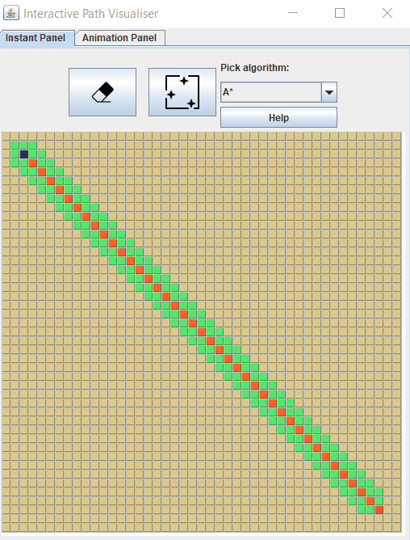

 
 # Path Visualiser

Simple Java program to visualise searching and path-finding algorithms

## Description

So far, the program supports the Dijkstra and the A* path-finding algorithms, as well as the Breadth-First search searching algorithms.
The first two search 8-directionally, whereas BFS has been implemented as a 4-directional search algorithm.

The program will attempt to find the shortest path from start (blue field) to goal (red field). Both exploration of the map and the process of mapping the path are animated.

The program allows the user to place and erase walls (```ctrl + LMB```) and swamp (```alt + RMB```). The former prevents the program from searching in a walled area, the latter carries a penalty for swamp fields, which the algorithm adjusts the path-finding for.

<p align="center">
<!--   
   -->
 
 
</p>

### Executing program

* Place the entire project in one folder.
* It can be run from command line with
```
java -jar PathVisualiserJava.jar
```

## Authors

Kasper Krawczyk
[kasper.krawczyk@gmail.com](kasper.krawczyk@gmail.com)

## Acknowledgements

Icons by <a target="_blank" href="https://icons8.com">Icons8</a>
